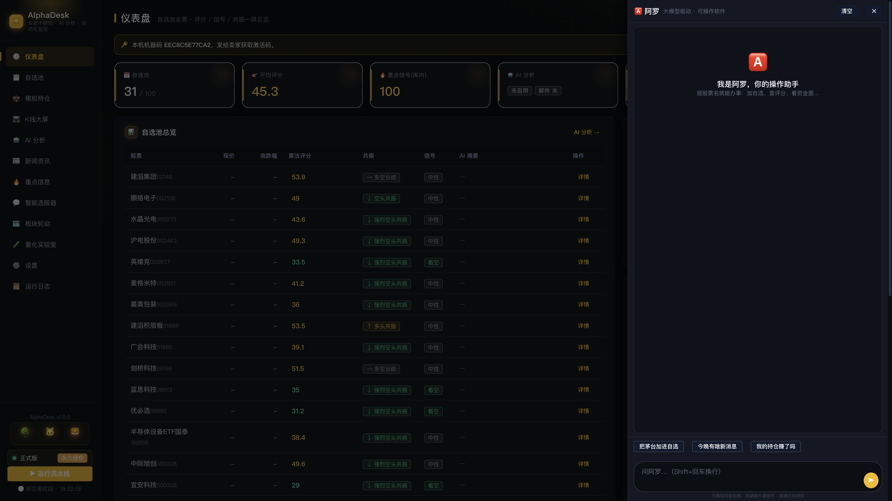
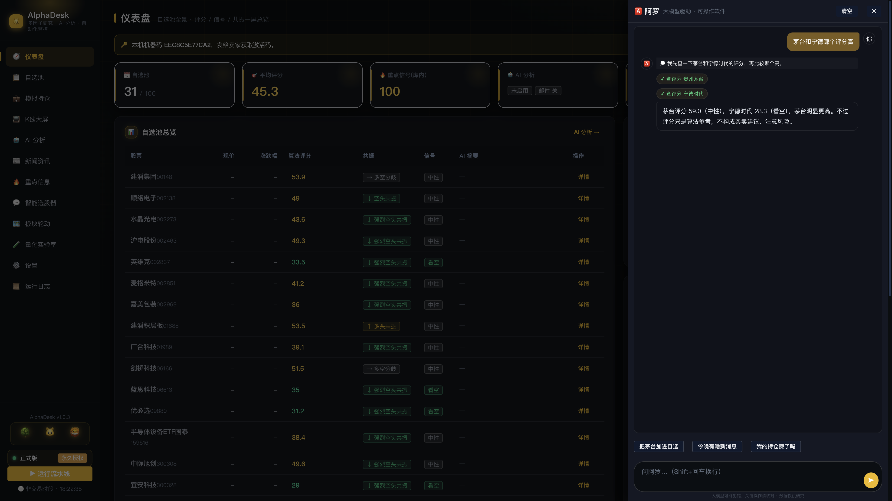
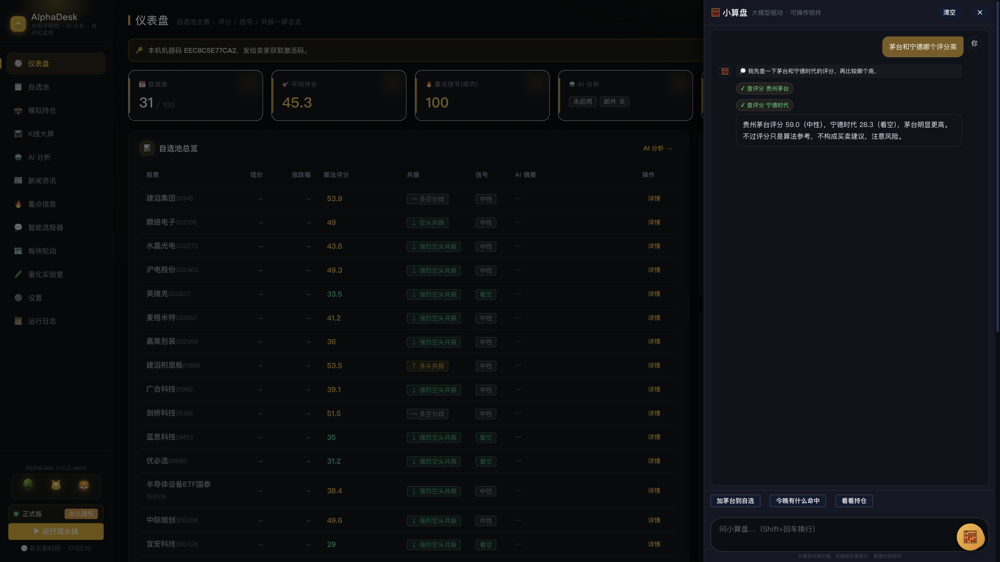

# 别再到处点菜单了：AlphaDesk 长了个会干活的 AI 助手「阿罗」

> 之前的 AI 只能"给结论"，这一次，它能"动手干活"了。
> 报股票名就行：加自选、查评分、看资金面，一句话搞定。

---

## 一句话认识阿罗

软件右下角多了一个红色 **🅰️ 悬浮钮**，点开就是阿罗（Alpha 音译）——AlphaDesk 的操作助手。

它和"AI 分析"不是一回事：

- **AI 分析**：给你结论（这只股票 59 分、中性）。
- **阿罗**：帮你办事（"把茅台加进自选"——加上了；"茅台和宁德哪个评分高"——查完告诉你）。

一个动嘴，一个动手。

---

## 它真听得懂人话

不需要记指令、不需要学格式，怎么平时说话就怎么问：

比如上面这句"**茅台和宁德哪个评分高**"——阿罗在背后做了三件事：

1. 分别查了两只股票的算法评分；
2. 看到结果后，自己决定"可以对比回复了"；
3. 组织成一句话告诉你，还补了句风险提醒。

这叫**多轮决策**：查 → 看结果 → 再决定下一步 → 回复。不是关键词匹配，是大模型（DeepSeek）在全程拿主意，思考过程展开给你看，不黑箱。

---

## 敢让它删东西：因为有"确认卡"

删自选、一键补跑这种不可逆的动作，阿罗不会自作主张——先弹确认卡，你点了"执行"它才干：

说错话也不怕酿祸。确认令牌 5 分钟过期，过期重来。

---

## 没配 Key 也能用，配了才完全体

- **不配 Key**：8 类固定说法秒回（加/删自选、查价、查评分、看资金面、切页面、补跑……），零成本、不联网调模型。
- **配个 DeepSeek Key**（设置里填一次）：人话全听懂，多轮决策、复杂追问随便来。一个用户一天也就几分钱。

试用到期后阿罗自动降为"只能查不能改"，激活即恢复——数据一只不少。

---

## 收盘后，它会主动找你

每天收盘流水线跑完，右下角冒小红点："今晚 N 条新消息，命中 M 只，看看？"——不用你去翻，重要的自己送上门。

---

## 多少钱，怎么试

AlphaDesk v1.0.3 已上架，阿罗、K线大屏、资金面分析都在里面：

- 7 天全功能试用，不用先付钱；
- 月卡 29.9，年卡 299（一机一码，换机免费）；
- 联系微信：964468802，备注"阿罗"，发你下载链接。

> 评分、选股与 AI 结论仅供学习研究，不构成投资建议。市场有风险，投资需谨慎。

---

*配图说明（按顺序插入）：wx-aluo-empty.png → wx-aluo-chat.png → wx-aluo-confirm.png*
*封面建议：用 wx-aluo-chat.png（有对话内容的一张），标题压字。*
